## AI DevSecOps Workflow

```mermaid
graph TD
    accTitle: AI DevSecOps Workflow
    accDescr: A comprehensive flowchart detailing the AI DevSecOps lifecycle from data ingestion to continuous monitoring.

    subgraph "Data Sourcing & Management"
        A[Data Ingestion] --> B{Data Quality & Bias Checks};
        B --> C[Data Encryption];
    end

    subgraph "Model Development"
        D[Feature Engineering] --> E[Model Training];
        E --> F{Threat Modeling};
        F --> G[Secure Coding & SAST];
    end

    subgraph "CI/CD Pipeline"
        H[Code Commit] --> I{CI Orchestration};
        I --> J[DAST & Dependency Scanning];
        J --> K[Container Scanning];
        K --> L[Model Validation];
        L --> M[Signed & Versioned Model];
    end

    subgraph "Model Deployment"
        N[Model Registry] --> O{Deployment to Staging};
        O --> P[Security & Penetration Testing];
        P --> Q{Production Deployment};
    end

    subgraph "Continuous Monitoring"
        R[Deployed Model] --> S{Performance Monitoring};
        S --> T[Drift Detection];
        T --> U[Security Incident Monitoring];
        U --> V[Feedback Loop to Development];
    end

    C --> D;
    G --> H;
    M --> N;
    Q --> R;

    classDef data fill:#e1f5fe,stroke:#01579b,stroke-width:2px;
    classDef model fill:#f3e5f5,stroke:#4a148c,stroke-width:2px;
    classDef cicd fill:#e8f5e9,stroke:#1b5e20,stroke-width:2px;
    classDef deploy fill:#fff3e0,stroke:#e65100,stroke-width:2px;
    classDef monitor fill:#fffde7,stroke:#fbc02d,stroke-width:2px;

    class A,B,C data;
    class D,E,F,G model;
    class H,I,J,K,L,M cicd;
    class N,O,P,Q deploy;
    class R,S,T,U,V monitor;

    click F "https://cheatsheetseries.owasp.org/cheatsheets/Threat_Modeling_Cheat_Sheet.html" "Learn more about Threat Modeling"
    click G "https://cheatsheetseries.owasp.org/cheatsheets/Static_Code_Analysis_Cheat_Sheet.html" "Learn more about SAST"
    click J "https://cheatsheetseries.owasp.org/cheatsheets/Vulnerability_Scanning_Cheat_Sheet.html" "Learn more about Vulnerability Scanning"
```



## Operational Issues in AI Workflows

```mermaid
mindmap
  accTitle: Operational Issues in AI Workflows
  accDescr: A mindmap categorizing various operational, security, and compliance issues in AI workflows.

  root((Operational Issues in AI Workflows))
    ::icon(fa fa-brain)
    Data Issues
      ::icon(fa fa-database)
      Data Drift
      Data Quality Degradation
      Data Poisoning
      Privacy Leaks
    Model Issues
      ::icon(fa fa-robot)
      Model Degradation
      Concept Drift
      Adversarial Attacks
      Explainability Issues
    Infrastructure Issues
      ::icon(fa fa-server)
      Pipeline Failures
      Scalability Problems
      Resource Starvation
      Latency Increases
    Security Issues
      ::icon(fa fa-shield-alt)
      Model Evasion
      Inference Attacks
      Vulnerabilities in Dependencies
      Unauthorized Access
    Compliance Issues
      ::icon(fa fa-gavel)
      Regulatory Violations (GDPR, CCPA)
      Audit Trail Gaps
      Unfair Bias
```
