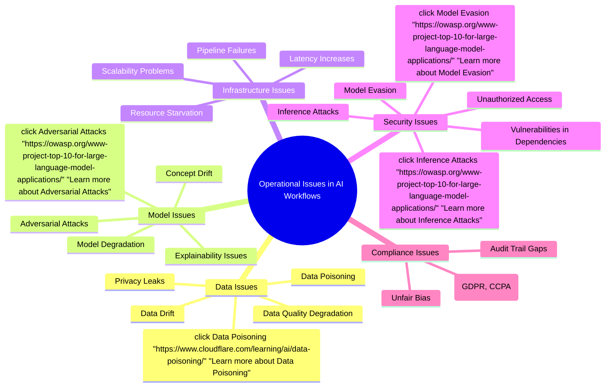

## AI DevSecOps Workflow

```mermaid
graph TD
    subgraph "Data Sourcing & Management"
        A[Data Ingestion] --> B{Data Quality & Bias Checks};
        B --> C[Data Encryption];
    end

    subgraph "Model Development"
        D[Feature Engineering] --> E[Model Training];
        E --> F{Threat Modeling};
        F --> G[Secure Coding & SAST];
        click G "https://en.wikipedia.org/wiki/Static_application_security_testing" "Learn more about SAST"
    end

    subgraph "CI/CD Pipeline"
        H[Code Commit] --> I{CI Orchestration};
        I --> J[DAST & Dependency Scanning];
        click J "https://en.wikipedia.org/wiki/Dynamic_application_security_testing" "Learn more about DAST"
        J --> K[Container Scanning];
        click K "https://owasp.org/www-project-devsecops-guideline/latest/02f-Container-Vulnerability-Scanning" "Learn more about Container Scanning"
        K --> L[Model Validation];
        L --> M[Signed & Versioned Model];
    end

    subgraph "Model Deployment"
        N[Model Registry] --> O{Deployment to Staging};
        O --> P[Security & Penetration Testing];
        click P "https://www.cloudflare.com/learning/security/glossary/what-is-penetration-testing/" "Learn more about Penetration Testing"
        P --> Q{Production Deployment};
    end

    subgraph "Continuous Monitoring"
        R[Deployed Model] --> S{Performance Monitoring};
        S --> T[Drift Detection];
        T --> U[Security Incident Monitoring];
        U --> V[Feedback Loop to Development];
    end

    C --> D;
    G --> H;
    M --> N;
    Q --> R;
```

## Operational Issues in AI Workflows

```mermaid
mindmap
  root((Operational Issues in AI Workflows))
    ::icon(fa fa-brain)
    Data Issues
      ::icon(fa fa-database)
      Data Drift
      Data Quality Degradation
      Data Poisoning
      click Data Poisoning "https://www.cloudflare.com/learning/ai/data-poisoning/" "Learn more about Data Poisoning"
      Privacy Leaks
    Model Issues
      ::icon(fa fa-robot)
      Model Degradation
      Concept Drift
      Adversarial Attacks
      click Adversarial Attacks "https://owasp.org/www-project-top-10-for-large-language-model-applications/" "Learn more about Adversarial Attacks"
      Explainability Issues
    Infrastructure Issues
      ::icon(fa fa-server)
      Pipeline Failures
      Scalability Problems
      Resource Starvation
      Latency Increases
    Security Issues
      ::icon(fa fa-shield-alt)
      Model Evasion
      click Model Evasion "https://owasp.org/www-project-top-10-for-large-language-model-applications/" "Learn more about Model Evasion"
      Inference Attacks
      click Inference Attacks "https://owasp.org/www-project-top-10-for-large-language-model-applications/" "Learn more about Inference Attacks"
      Vulnerabilities in Dependencies
      Unauthorized Access
    Compliance Issues
      ::icon(fa fa-gavel)
      Regulatory Violations (GDPR, CCPA)
      Audit Trail Gaps
      Unfair Bias
```
