## AI DevSecOps Workflow

```mermaid
graph TD
    subgraph "Data Sourcing & Management"
        A[Data Ingestion] --> B{Data Quality & Bias Checks};
        B --> C[Data Encryption];
    end

    subgraph "Model Development"
        D[Feature Engineering] --> E[Model Training];
        E --> F{Threat Modeling};
        F --> G[Secure Coding & SAST];
        click G "https://en.wikipedia.org/wiki/Static_application_security_testing" "Learn more about SAST"
    end

    subgraph "CI/CD Pipeline"
        H[Code Commit] --> I{CI Orchestration};
        I --> J[DAST & Dependency Scanning];
        click J "https://en.wikipedia.org/wiki/Dynamic_application_security_testing" "Learn more about DAST"
        J --> K[Container Scanning];
        click K "https://owasp.org/www-project-devsecops-guideline/latest/02f-Container-Vulnerability-Scanning" "Learn more about Container Scanning"
        K --> L[Model Validation];
        L --> M[Signed & Versioned Model];
    end

    subgraph "Model Deployment"
        N[Model Registry] --> O{Deployment to Staging};
        O --> P[Security & Penetration Testing];
        click P "https://www.cloudflare.com/learning/security/glossary/what-is-penetration-testing/" "Learn more about Penetration Testing"
        P --> Q{Production Deployment};
    end

    subgraph "Continuous Monitoring"
        R[Deployed Model] --> S{Performance Monitoring};
        S --> T[Drift Detection];
        T --> U[Security Incident Monitoring];
        U --> V[Feedback Loop to Development];
    end

    C --> D;
    G --> H;
    M --> N;
    Q --> R;
```



## Operational Issues in AI Workflows

```mermaid
mindmap
  root((Operational Issues in AI Workflows))
    ::icon(fa fa-brain)
    Data Issues
      ::icon(fa fa-database)
      Data Drift
      Data Quality Degradation
      Data Poisoning
      Privacy Leaks
    Model Issues
      ::icon(fa fa-robot)
      Model Degradation
      Concept Drift
      Adversarial Attacks
      Explainability Issues
    Infrastructure Issues
      ::icon(fa fa-server)
      Pipeline Failures
      Scalability Problems
      Resource Starvation
      Latency Increases
    Security Issues
      ::icon(fa fa-shield-alt)
      Model Evasion
      Inference Attacks
      Vulnerabilities in Dependencies
      Unauthorized Access
    Compliance Issues
      ::icon(fa fa-gavel)
      Regulatory Violations (GDPR, CCPA)
      Audit Trail Gaps
      Unfair Bias
  click "Data Drift" "https://www.google.com/search?q=Data+Drift" "_blank"
  click "Data Quality Degradation" "https://www.google.com/search?q=Data+Quality+Degradation" "_blank"
  click "Data Poisoning" "https://www.google.com/search?q=Data+Poisoning" "_blank"
  click "Privacy Leaks" "https://www.google.com/search?q=Privacy+Leaks" "_blank"
  click "Model Degradation" "https://www.google.com/search?q=Model+Degradation" "_blank"
  click "Concept Drift" "https://www.google.com/search?q=Concept+Drift" "_blank"
  click "Adversarial Attacks" "https://www.google.com/search?q=Adversarial+Attacks" "_blank"
  click "Explainability Issues" "https://www.google.com/search?q=Explainability+Issues" "_blank"
  click "Pipeline Failures" "https://www.google.com/search?q=Pipeline+Failures" "_blank"
  click "Scalability Problems" "https://www.google.com/search?q=Scalability+Problems" "_blank"
  click "Resource Starvation" "https://www.google.com/search?q=Resource+Starvation" "_blank"
  click "Latency Increases" "https://www.google.com/search?q=Latency+Increases" "_blank"
  click "Model Evasion" "https://www.google.com/search?q=Model+Evasion" "_blank"
  click "Inference Attacks" "https://www.google.com/search?q=Inference+Attacks" "_blank"
  click "Vulnerabilities in Dependencies" "https://www.google.com/search?q=Vulnerabilities+in+Dependencies" "_blank"
  click "Unauthorized Access" "https://www.google.com/search?q=Unauthorized+Access" "_blank"
  click "Regulatory Violations (GDPR, CCPA)" "https://www.google.com/search?q=Regulatory+Violations+(GDPR,+CCPA)" "_blank"
  click "Audit Trail Gaps" "https://www.google.com/search?q=Audit+Trail+Gaps" "_blank"
  click "Unfair Bias" "https://www.google.com/search?q=Unfair+Bias" "_blank"
```
